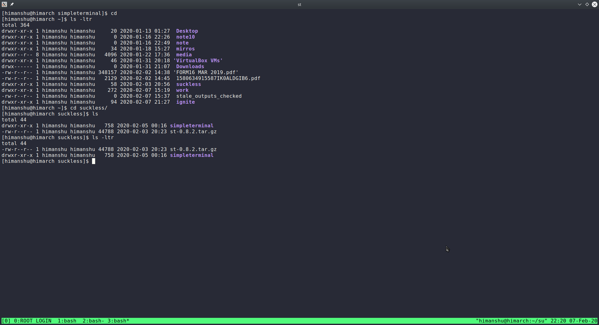

# Simple Terminal (ST 0.8.2) with Patches



Simple Terminal (st) my personal customizations. 

## How to compile and Install Terminal
```shell
cd  path/to/code/simpleterminal
#Be careful, take backup if needed.
rm config.h
sudo make clean install
```

## Changes Summary
* Simple Terminal version st 0.8.2 (2019-02-09).
* Patch Desktop Entry: Creates a desktop-entry for st.
* Patch Dracula: Dracula Color Scheme.
* Patch Scrollback: Scroll back using shift + up.
* Patch Mouse ScrollBack: Scroll back using shift + Mouse wheel.
* DrawBox Patch: Gapless alignment.
* Anysize Patch:  With this patch, st on a tiling WM will always fill the entire space allocated to it.
* Font: Inconsolata Size: 16
* Default Rows : 43
* Default Columns: 150
* Mouse : XC_LEFT_ptr
* Cursor: BLOCK

## Colors
-  `Background Color`
-  `Foreground Color`


## Related Links

[ST Home Page](https://st.suckless.org/)
[Desktopentry Patch ](https://st.suckless.org/patches/desktopentry/)
[Dracula Color Scheme Patch ](https://st.suckless.org/patches/dracula/)
[Scrollback Patch ](https://st.suckless.org/patches/scrollback/)
[Drabox Patch](https://st.suckless.org/patches/boxdraw/)
[Scrollback Mouse Patch](https://st.suckless.org/patches/scrollback)
[Anysize Patch](https://st.suckless.org/patches/anysize/)


## How to apply addtional Patches 
If needed, addtional patches can be dowloaded from suckless.org. To apply patch use below command.
```shell
cd  path/to/code/simpleterminal
patch -p1 < path/to/patch.diff
#Be careful, take backup if needed.
rm config.h
sudo make clean install
```

Tested on ArchLinux using KDE

Regards,

Himanshu Ahire
